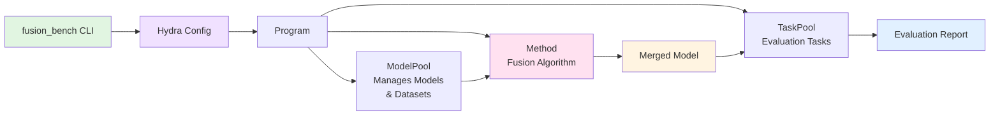

<div align="center">

# FusionBench Project Template


[](https://www.python.org/)
[](https://pytorch.org/get-started/locally/)
[](https://pytorchlightning.ai/)
[](https://hydra.cc/)
[](https://black.readthedocs.io/en/stable/)
[](https://pycqa.github.io/isort/)

FusionBench is a PyTorch-based comprehensive benchmark/toolkit for deep model fusion. This repository serves as a template for creating new projects based on FusionBench. It includes all the necessary configurations and boilerplate code to get started quickly.

Click on [<kbd>Use this template</kbd>](https://github.com/fusion-bench/fusion-bench-project-template/generate) to initialize new repository.

</div>

## Introduction

FusionBench Project Template is designed to help researchers and developers quickly set up a new project for deep model fusion using PyTorch and FusionBench. This template provides a well-organized project structure, pre-configured settings, and essential tools to streamline the development process. Key features include:

- **Hydra Configuration**: Simplifies the management of complex configurations.
- **PyTorch Lightning**: Facilitates the training and evaluation of models.
- **Pre-configured Linters**: Ensures code quality with tools like Black and isort.
- **Jupyter Notebooks**: Supports interactive development and experimentation.
- **Modular Design**: Encourages clean and maintainable code with a clear separation of concerns.

By using this template, you can focus on developing and experimenting with your fusion models without worrying about the initial setup and configuration.

## Project Structure

The directory structure of new project looks like this:

```plaintext
├── .github                   <- Github Actions workflows
├── .vscode                   <- VSCode settings
├── config                    <- Hydra configs
│   ├── hydra                    <- Hydra configs
│   ├── fabric                   <- Fabric configs
│   ├── fabric_logger            <- Fabric logger configs
│   ├── method                   <- Method configs
│   ├── modelpool                <- Model pool configs
│   ├── taskpool                 <- Task pool configs
│   │
│   └── main.yaml            <- Main config for training
│
├── notebooks              <- Jupyter notebooks. Here you can place 
|                             some example code and notebooks.
|
├── scripts                <- Shell scripts
│
├── src                    <- Source code
│   ├── data                     <- Data classes
│   ├── models                   <- Model classes
│   ├── method                   <- Method classes
│   ├── modelpool                <- Model pool classes
|   ├── taskpool                 <- Task pool classes
│   └── utils                    <- Utility functions
|
├── tests                  <- Tests of any kind
│
├── .gitignore                <- List of files ignored by git
├── requirements.txt          <- File for installing python dependencies
├── setup.py                  <- File for installing project as a package
└── README.md
```


## The FusionBench Workflow

FusionBench follows a three-component architecture to perform model fusion experiments:



**Key Components:**

1. **CLI**: Entry point using Hydra for configuration management
2. **Program**: Orchestrates the fusion workflow (e.g., `FabricModelFusionProgram`)
3. **ModelPool**: Manages task-specific models and their datasets
4. **Method**: Implements the fusion algorithm (e.g., Simple Average, Task Arithmetic, AdaMerging)
5. **TaskPool**: Evaluates the merged model on benchmark tasks

**Workflow Steps:**

1. User runs `fusion_bench` with config overrides
2. Hydra loads YAML configs for method, modelpool, and taskpool
3. Program instantiates all three components
4. Method executes fusion algorithm on ModelPool
5. TaskPool evaluates the merged model
6. Results are saved and reported

## Acknowledgement

This template is motivated by [Lightning-Hydra-Template](https://github.com/ashleve/lightning-hydra-template).

<br/>
<br/>
<br/>


> [!NOTE]
> **DELETE EVERYTHING ABOVE FOR YOUR PROJECT**

______________________________________________________________________

<div align="center">

# Your Project Name

<a href="https://pytorch.org/get-started/locally/"></a>
<a href="https://pytorchlightning.ai/"></a>
<a href="https://hydra.cc/"></a>
<a href="https://github.com/fusion-bench/fusion-bench-project-template"></a><br>

</div>

## Description

What it does

## Installation

#### Pip

```bash
# clone project
git clone https://github.com/YourGithubName/your-repo-name
cd your-repo-name

# [OPTIONAL] create conda environment
conda create -n myenv python=3.12 # recommend python 3.12+
conda activate myenv

# install pytorch according to instructions
# https://pytorch.org/get-started/

# install requirements
pip install -r requirements.txt
# install project as editable package (edit pyproject.toml as needed)
pip install -e .
```

#### Conda

```bash
# clone project
git clone https://github.com/YourGithubName/your-repo-name
cd your-repo-name

# create conda environment and install dependencies
conda env create -n myenv python=3.12

# activate conda environment
conda activate myenv
```

## How to run

run my method

```shell
fusion_bench \
    --config-name main \
    # method=...
    # method.option_1=...
    # modelpool=...
    # ...
```

or

```shell
bash scripts/run_experiments.sh
```

## Acknowledgement

This project is based on [FusionBench](https://github.com/tanganke/fusion_bench) and created using [FusionBench Project Template](https://github.com/fusion-bench/fusion-bench-project-template).
